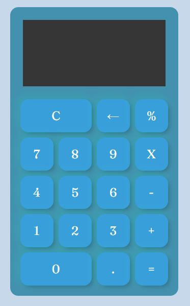

# Práctica CSS

# CalculadoraJS

Uno de los primeros ejercicios de todo curso de programación es hacer una calculadora ya que te permite aprender. 
Para esta tarea debes hacer una calculadora con las siguientes operaciones:

- Suma 
- Resta 
- Multiplicación 
- División 
- Raiz cuiadrada 
- Potencia al número qe el usuario te diga 
- Residuo de una división 

-Una imágen de la calculadora terminada.

- Estilos con CSS (Lo más acercado posible, pueden ser otras imágenes, íconos o colores, pero tiene que ser lo más cercano que puedas)

Bonus:
- Bonus de diseños o páginas adicionales (Totalmente a tu creatividad)

***¡Vámonos hasta el espacio y más allá Explorers!***

<a href="https://github.com/ciloachamin/Launch-X-Latam" target="_self">Regresar a pagina anterior</a>
